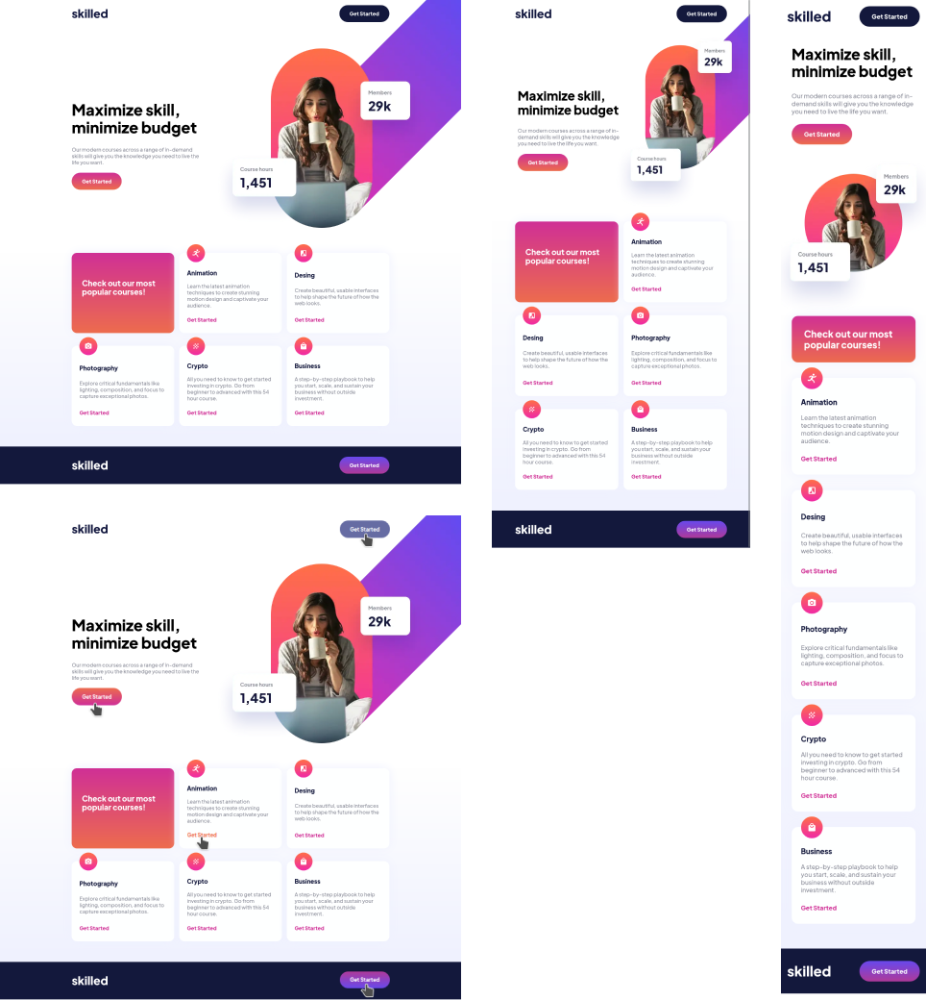

# Frontend Mentor - Skilled e-learning landing page

This is a solution to the [Skilled e-learning landing page](https://www.frontendmentor.io/challenges/skilled-elearning-landing-page-S1ObDrZ8q). Frontend Mentor challenges help you improve your coding skills by building realistic projects.

## Table of contents

- [Overview](#overview)
  - [The challenge](#the-challenge)
  - [Screenshot](#screenshot)
  - [Links](#links)
- [My process](#my-process)
  - [Built with](#built-with)
  - [What I learned](#what-i-learned)
  - [Continued development](#continued-development)
  - [Useful resources](#useful-resources)
- [Author](#author)

## Overview

### The challenge

Users should be able to:

- View the optimal layout for the content depending on their device's screen size

### Screenshot

### Links

- [Solution URL](https://github.com/Alejandro25AR/landing-page-skilled)
- [Live Site URL](https://your-live-site-url.com)

## My process

### Built with

- Semantic HTML5
- SCSS with BEMIT
- Flexbox
- CSS Grid
- Mobile-first workflow
- JS Vanilla

### What I learned

I reinforced the concepts of flexbox and css grid.

### Continued development

The BEMIT convention is very useful because it allows us to write maintainable styles.

### Useful resources

- [A Complete Guide to Flexbox ](https://css-tricks.com/snippets/css/a-guide-to-flexbox/)
- [NO uses el TRANSFORM de CSS para COLOCAR ETIQUETAS | Eduardo Fierro Pro ](https://www.youtube.com/shorts/EC6Vt1cEDiM)

## Author

- Frontend Mentor - [@Alejandro25AR](https://www.frontendmentor.io/profile/Alejandro25AR)